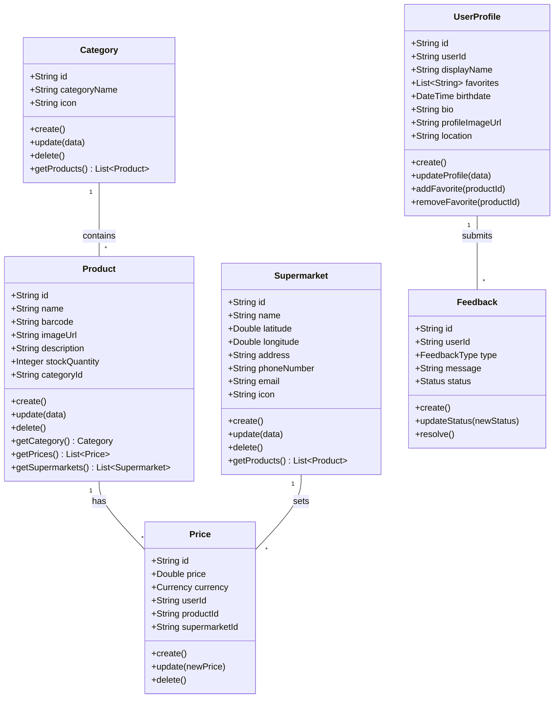
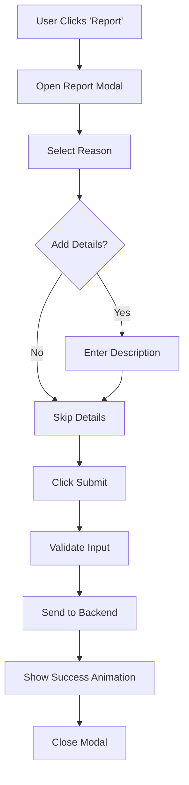
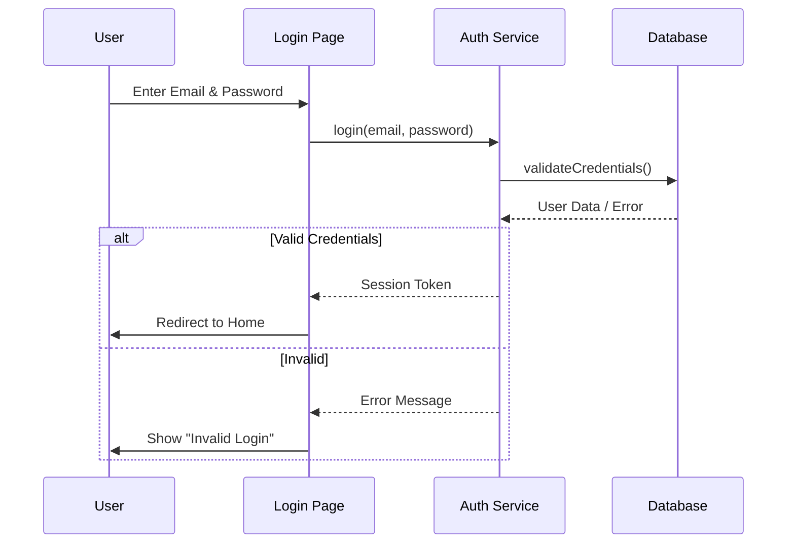
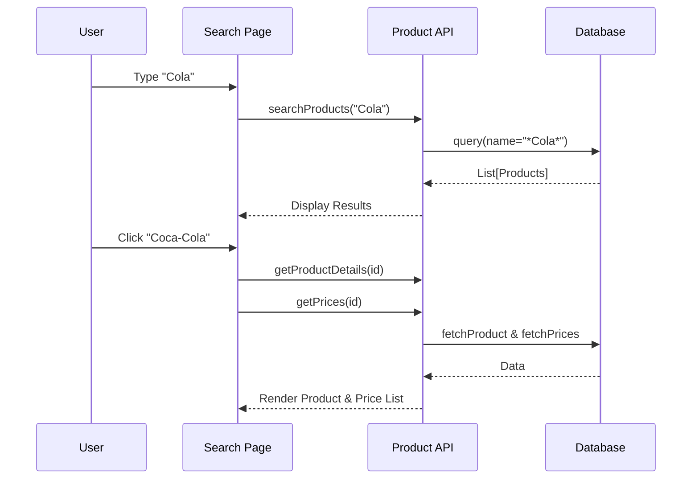
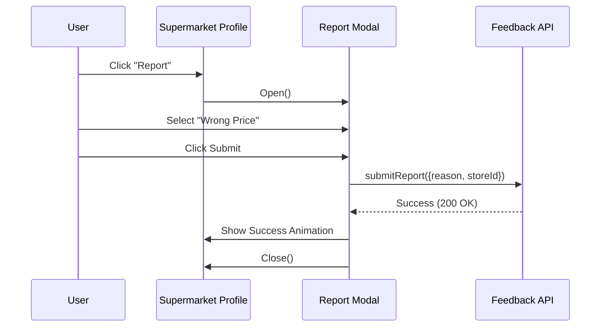

# PriceMate Project Documentation

## 1. Use Cases Table

| Use Case ID | Use Case Name | Actor | Goal | Preconditions | Stimulus | Scenario | Exceptions |
| :--- | :--- | :--- | :--- | :--- | :--- | :--- | :--- |
| UC-01 | Register User | Guest | To create a new account | User is not logged in | User clicks "Register" link | 1. User enters email, password, name.<br>2. System validates input.<br>3. System creates account.<br>4. System logs user in. | Email already exists, Invalid password format. |
| UC-02 | Login User | Guest | To access the application | User has an account | User enters credentials | 1. User enters email and password.<br>2. System validates credentials.<br>3. System grants access.<br>4. Redirects to Home. | Invalid credentials, Account locked. |
| UC-03 | Search Products | User | To find specific products | User is logged in | User types in search bar | 1. User types query (e.g., "Milk").<br>2. System filters products.<br>3. System displays matching results. | No products found. |
| UC-04 | Scan Barcode | User | To find product by barcode | Camera permission granted | User clicks scan button | 1. User points camera at barcode.<br>2. System detects barcode.<br>3. System fetches product details.<br>4. Redirects to comparison page. | Barcode not found, Camera error. |
| UC-05 | Compare Prices | User | To find the cheapest price | Product selected | User views product details | 1. System fetches prices from all supermarkets.<br>2. System sorts by price.<br>3. System highlights lowest price.<br>4. User views comparison list. | No prices available for product. |
| UC-06 | View Supermarket | User | To see store details | None | User clicks store name | 1. System fetches store info (banner, logo).<br>2. System fetches available products.<br>3. Displays profile page. | Store not found. |
| UC-07 | Report Issue | User | To correct data | User is logged in | User clicks "Report" | 1. User selects "Report" on store/product.<br>2. Selects reason (e.g., "Wrong Price").<br>3. Submits report.<br>4. System acknowledges receipt. | Network error. |
| UC-08 | Toggle Theme | User | To switch light/dark mode | None | User clicks theme icon | 1. User clicks Sun/Moon icon.<br>2. System toggles CSS theme.<br>3. Saves preference to local storage. | None. |
| UC-09 | View Featured | User | To see popular items | None | User loads Home page | 1. System fetches featured products.<br>2. Displays product cards.<br>3. Shows current prices. | Data fetch error. |
| UC-10 | Logout | User | To end session | User is logged in | User clicks Logout | 1. User clicks Logout.<br>2. System clears session.<br>3. Redirects to Login page. | None. |
| UC-11 | Follow Store | User | To get updates | User is logged in | User clicks Follow | 1. User clicks Follow on store profile.<br>2. System updates user's followed list.<br>3. Button state changes to "Following". | Network error. |
| UC-12 | View Profile | User | To see account info | User is logged in | User clicks Avatar | 1. System fetches user details.<br>2. Displays name, email, stats.<br>3. Shows recent activity. | None. |
| UC-13 | Filter Categories | User | To browse by type | None | User selects category | 1. User clicks "Beverages".<br>2. System filters product list.<br>3. Displays only beverage items. | No items in category. |
| UC-14 | Send Message | User | To contact store | User is logged in | User clicks Message | 1. User clicks Message button.<br>2. Opens chat/email interface.<br>3. User sends inquiry. | Feature unavailable. |

---

## 2. Backend Database Diagram (Appwrite Schema)

```mermaid
erDiagram
    category ||--o{ products : "contains"
    
    products }|--o{ prices_collection : "has"
    supermarkets }|--o{ prices_collection : "sets"
    
    products }|--o{ supermarkets : "available at"
    
    category {
        string $id PK
        string categoryName
        string icon
    }

    products {
        string $id PK
        string name
        string barcode
        string imageUrl
        string description
        integer stockQuantity
        string categoryId FK
    }

    supermarkets {
        string $id PK
        string name
        double latitude
        double longitude
        string address
        string phoneNumber
        string email
        string icon
    }

    prices_collection {
        string $id PK
        double price
        enum currency
        string userId
        string products FK
        string supermarkets FK
    }

    feedback {
        string $id PK
        string userId
        enum type
        string message
        enum status
    }

    user_profiles {
        string $id PK
        string userId
        string displayName
        enum favorites
        datetime birthdate
        string bio
        string profileImageUrl
        string location
    }
```

---

## 3. Class Diagram



---

## 4. Use Case Diagram

```mermaid
usecaseDiagram
    actor "Guest" as g
    actor "Registered User" as u
    actor "Admin" as a

    package PriceMate {
        usecase "Register" as UC1
        usecase "Login" as UC2
        usecase "Search Products" as UC3
        usecase "Scan Barcode" as UC4
        usecase "Compare Prices" as UC5
        usecase "View Supermarket" as UC6
        usecase "Report Issue" as UC7
        usecase "Manage Data" as UC8
    }

    g --> UC1
    g --> UC2
    
    u --> UC2
    u --> UC3
    u --> UC4
    u --> UC5
    u --> UC6
    u --> UC7
    
    a --> UC8
    a --> UC2
```

---

## 5. Activity Diagrams

### 5.1 Price Comparison Flow

```mermaid
flowchart TD
    A[Start] --> B{Has Barcode?}
    B -- Yes --> C[Scan Barcode]
    B -- No --> D[Search by Name]
    C --> E[Fetch Product Details]
    D --> E
    E --> F{Product Found?}
    F -- No --> G[Show 'Not Found' Message]
    G --> H[End]
    F -- Yes --> I[Fetch Prices from All Supermarkets]
    I --> J[Sort Prices (Low to High)]
    J --> K[Highlight Lowest Price]
    K --> L[Display Comparison List]
    L --> M[End]
```

### 5.2 Report Issue Flow



---

## 6. Sequence Diagrams

### 6.1 Login Process



### 6.2 Search & View Product



### 6.3 Report Issue



---


